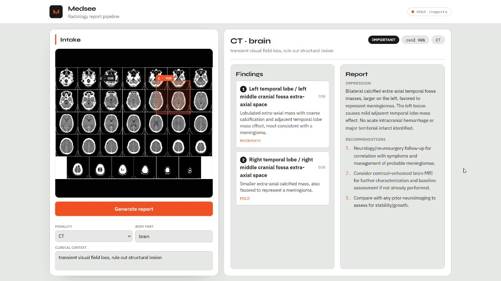
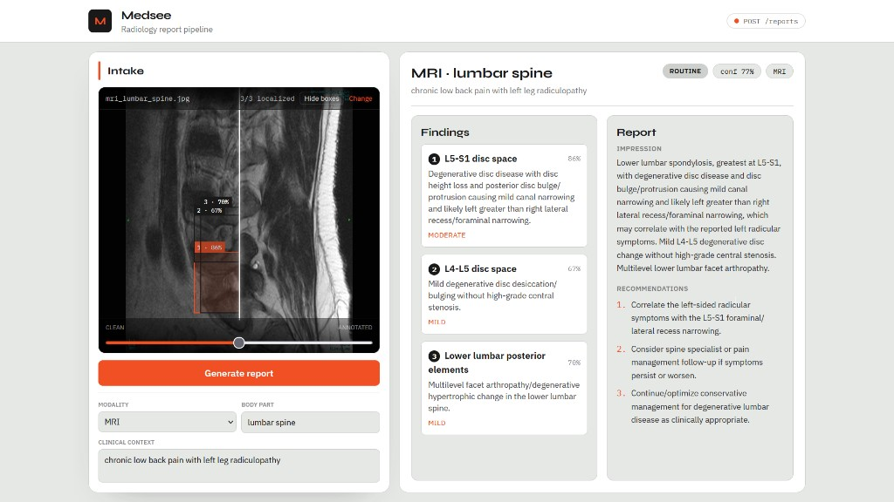
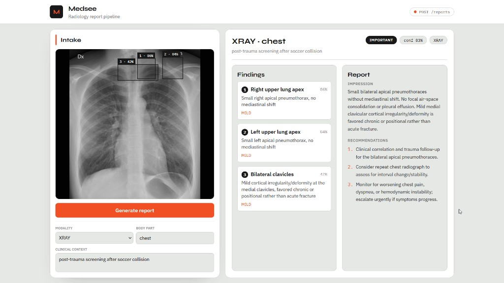

# Medsee — Radiology Reporting Pipeline

A full-stack POC for multi-step radiology reporting: upload a study, extract structured findings with vision LLM localization, validate output, assemble a clinical report, and review everything in a browser UI with interactive bounding-box overlays.

## Contents

- [Screenshots](#screenshots)
- [Features](#features)
- [Architecture](#architecture)
- [Setup](#setup)
- [Development](#development)
- [API](#api)
- [Project Structure](#project-structure)
- [Stack](#stack)

## Screenshots

### Brain CT — bilateral extra-axial masses



### Lumbar MRI — multilevel degenerative disc disease



### Chest X-ray — bilateral apical pneumothoraces



## Features

- **Chained LLM pipeline** — Call 1 extracts findings; validation gate; Call 2 assembles impression, recommendations, and urgency
- **Modality routing** — MRI, CT, and XRAY pipeline configs via `pipelines/configs/modalities.json`
- **Spatial localization** — Vision model returns normalized bounding boxes (`FindingRegion`); backend overlays a 10×10 coordinate grid (Pillow) to improve localization
- **Study viewer UI** — Single intake image with SVG overlays, hover sync to findings list, YouTube-style click-to-reveal controls, and a Clean ↔ Annotated comparison slider
- **Resilient API** — Malformed LLM output returns degraded JSON with step status flags instead of crashing

## Architecture

```
Upload + metadata → modality router → Call 1 (findings + regions)
  → validation gate → Call 2 (report) → PipelineResponse JSON → React UI
```

## Prerequisites

- [uv](https://docs.astral.sh/uv/) package manager
- Python 3.12+
- Node.js 20+ (frontend)
- OpenAI API key (vision-capable model, default `gpt-4o`)

## Setup

```bash
# Backend dependencies
uv sync

# Frontend dependencies
cd frontend && npm install && cd ..

# Environment
cp .env.example .env
# Set OPENAI_API_KEY in .env
```

## Development

```powershell
# Terminal 1 — API (http://127.0.0.1:8000)
.\scripts\start-backend.ps1

# Terminal 2 — UI (http://127.0.0.1:5173)
.\scripts\start-frontend.ps1
```

Open http://127.0.0.1:5173, upload a study, and click **Generate report**. Click the image to show or hide viewer controls (filename, overlay toggle, Clean/Annotated slider).

```bash
# Lint / format / test
uv run ruff check .
uv run ruff format .
uv run pytest -q
```

## API

| Endpoint | Method | Description |
|----------|--------|-------------|
| `/` | GET | Service info |
| `/health` | GET | Health check |
| `/reports` | POST | Upload image + metadata, run reporting pipeline |
| `/docs` | GET | OpenAPI interactive docs |

### Example: create a report

```bash
curl -X POST http://127.0.0.1:8000/reports \
  -F 'image=@scan.png' \
  -F 'metadata={"modality":"MRI","body_part":"lumbar spine","clinical_context":"chronic low back pain"}'
```

### Finding region schema

Each finding may include an optional normalized bounding box:

```json
{
  "location": "L5-S1 disc space",
  "description": "Disc bulge with mild canal narrowing",
  "severity": "moderate",
  "confidence_score": 0.86,
  "region": { "x": 0.42, "y": 0.31, "width": 0.18, "height": 0.12 }
}
```

Coordinates are 0–1 relative to image dimensions. The frontend renders overlays client-side; no server-side image mutation is returned.

## Project Structure

```
src/medsee/
├── api/             # HTTP routes (POST /reports, GET /health)
├── core/            # Config, logging
├── models/          # Pydantic contracts (Finding, FindingRegion, PipelineResponse)
├── pipelines/       # Modality routing configs
├── llm/             # Pydantic AI agents (findings + report)
└── services/        # Pipeline orchestration, validation, image grid overlay

frontend/
├── src/App.tsx              # Intake form + report display
└── src/ImageFindingsViewer.tsx  # Study viewer with overlays + comparison slider

docs/screenshots/    # README demo images
scripts/             # start-backend.ps1, start-frontend.ps1
```

## Stack

| Layer | Choice |
|-------|--------|
| Backend | FastAPI, Uvicorn, Pydantic AI, OpenAI |
| Frontend | Vite, React, TypeScript, Tailwind CSS v4 |
| Image grid | Pillow (coordinate reference overlay for Call 1) |
| Logging | Rich terminal logging |
| Lint / test | Ruff, pytest, httpx |

## Agent Documentation

- [`AGENTS.md`](AGENTS.md) — architecture, workflow, and constraints for AI agents
- [`TASKS.md`](TASKS.md) — phased progress tracker (Phases 0–9 complete)

## Disclaimer

This is a proof-of-concept. LLM-estimated bounding boxes are approximate and not clinically validated. Do not use for real diagnostic decisions.
